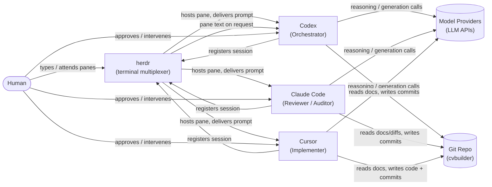
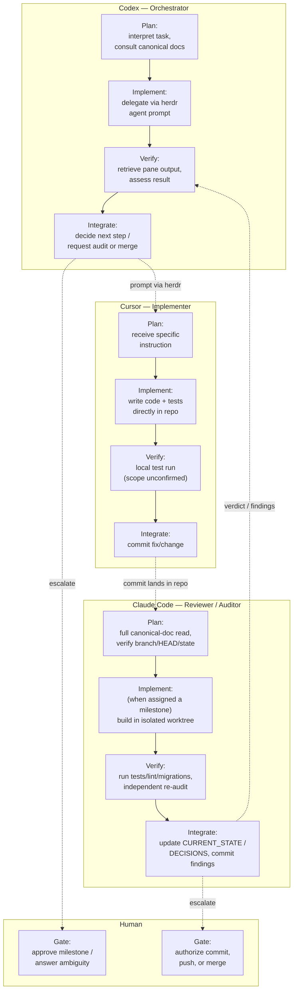
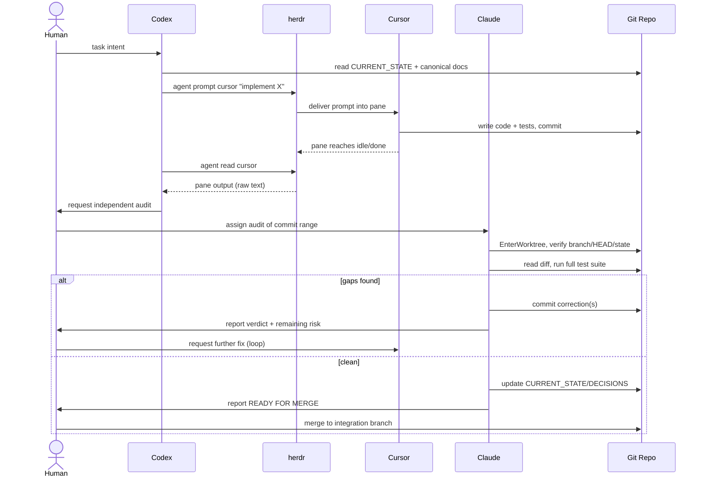
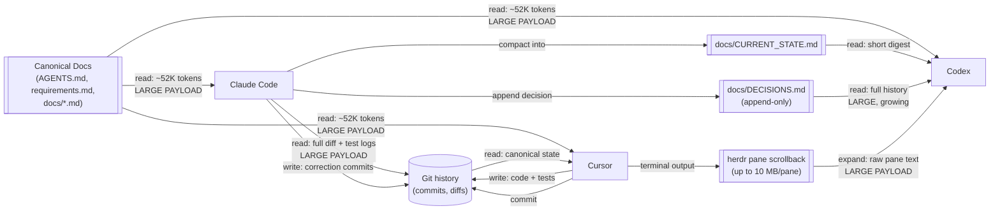

# Multi-Agent Development Framework — Architecture Overview

**Status:** Architecture/process overview — describes the tooling and agent framework around this repository, not the CVBuilder V2 product itself. Where a detail is inferred rather than directly evidenced, it is marked `[inferred]`; everything else was confirmed by reading repo files, herdr's own config/logs, or git history.

## Summary

CVBuilder V2 is developed by three coding agents — Codex (Orchestrator), Claude Code (Reviewer/Auditor), and Cursor (Implementer) — hosted in separate terminal panes by **herdr**, a terminal multiplexer that tracks which agent+session occupies which pane and exposes a small CLI (`agent prompt`, `agent read`, `pane read`) for pushing text into a pane and pulling it back out. herdr itself has no repository footprint and no opinion about *what* work happens — the actual coordination contract lives entirely in this repo's own `AGENTS.md` → `docs/ENGINEERING_RULES.md` → `docs/DECISIONS.md` precedence chain, which every agent is instructed to read before touching anything, and in git itself, which is the only artifact all three agents provably share. Direct evidence from this repository's own history (a run of five unattributed "fix:" commits landing on the M3A branch between two Claude Code commits, addressing exactly the kind of gaps an independent audit finds) shows this loop actually running: implement → audit → fix → re-audit, coordinated through commits rather than through any herdr-level shared state.

---

## 1. System Context

- herdr is purely infrastructure: it hosts panes, registers which agent/session lives in each one (a one-shot handshake, not a data channel), and offers on-demand read/write into a pane — it does not itself carry task content between agents.
- All three agents call out to external model providers independently for their own reasoning/generation; herdr and the repo have no visibility into those calls.
- The repository (git) is the only artifact genuinely shared and durable across all three agents — everything else (a pane's live terminal state, herdr's session registry) is ephemeral per machine/session.
- The human's role shown here is direct: typing into panes and approving/intervening, evidenced by herdr's pane model requiring a human-attended terminal session per agent.
- `Codex -- reads docs, writes commits` and the equivalent for Cursor are `[inferred]`: not directly observed, but consistent with git history (unattributed commits appearing on shared branches) and with `AGENTS.md` explicitly being written as instructions "for any coding agent."

## 2. Role Responsibilities

- Each agent's activities are grouped into the same four phases (Plan → Implement → Verify → Integrate) so the diagram is comparable across roles, even though the roles are asymmetric in practice.
- Claude's "Plan" phase is the heaviest of the three by design and by evidence: `AGENTS.md` mandates a full canonical-doc read and an explicit branch/HEAD/`git status` check before any change, and this session did exactly that before starting M3A.
- Cursor's activities are `[inferred]` beyond "writes code + tests directly in repo," which is directly evidenced (concurrent edits to this session's own `candidate_memory/` files were observed live, followed by matching "fix:" commits in git history) — Cursor's own verify step and whether it reads the canonical docs at all were not directly observed.
- The cross-box dashed arrows are the actual inter-agent handoffs: Codex delegating to Cursor, Cursor's commit becoming Claude's audit input, and Claude's verdict feeding back to Codex — each is evidenced only at the endpoints (a prompt is sent; a commit exists; a verdict exists), not as an observed continuous channel.
- Both Codex and Claude have an escalation path to a Human gate — this matches `docs/ENGINEERING_RULES.md` §C ("never commit/push without being asked") and this repository's repeated pattern of stopping for explicit authorization before destructive or scope-expanding actions.
- Cursor has no drawn escalation path to a Human gate in this diagram because no evidence of one was found — `[inferred absence]`, not a confirmed constraint.

## 3. Task Lifecycle

- The `alt` branch is not decorative — it is the evidenced steady state on this repository's own M3A branch: two Claude Code commits (`feat:`/`docs:`) were followed by five unattributed `fix:` commits before the branch was considered stable, matching an implement → audit → fix loop rather than a single clean pass.
- `Codex->>herdr: agent read cursor` and the raw-text return are `[inferred]`: the CLI capability and its lack of a size cap are confirmed by reading herdr's own `--skill` output, but no live call was captured.
- The merge step (`Human->>Repo: merge to integration branch`) is `[inferred]`: no CI or PR automation was found anywhere in the repository, so a human-driven merge is the only mechanism consistent with the absence of automation, not something directly observed happening.
- `Claude->>Repo: EnterWorktree, verify branch/HEAD/state` is directly evidenced by this session's own tool use at the start of the M3A task and again at the start of this documentation task.
- The diagram deliberately shows one full cycle; in practice the loop can repeat (this repo's own `docs/DECISIONS.md` records a second independent re-audit correction on the M2 milestone before that work was considered mergeable).

## 4. Context and Artifact Flow

- The clearest **compaction point** in the whole system is Claude writing to `docs/CURRENT_STATE.md`: a full test run plus a full canonical-doc reconciliation gets reduced to a short, operational snapshot other agents can read cheaply instead of re-deriving it.
- The clearest **expansion point** is the herdr pane-scrollback path: Cursor's entire terminal session (tool calls, diffs, test output) can be pulled back into Codex's context as unbounded raw text, the inverse of compaction.
- `docs/DECISIONS.md` is annotated as a large and *growing* read because it is explicitly append-only by convention — every past milestone's decisions remain in the mandatory read set indefinitely.
- Three edges are marked `LARGE PAYLOAD`: the ~52K-token canonical-doc read (paid once per agent per session, evidenced by direct file measurement), the full-diff-and-log read Claude performs during audit (evidenced by this session's own tool use), and the raw pane-scrollback read Codex can perform (evidenced by mechanism/ceiling, not a captured payload — `[inferred]` frequency).
- `Repo -- read: canonical state --> Cursor` is `[inferred]`: Cursor's actual reads were not observed, only its writes (via the concurrent-edit evidence and the resulting commits).

---

## Known gaps

- **No direct evidence of Cursor's own instruction/system prompt, or whether it reads the canonical doc set at all.** Its planning and verification behavior in diagrams 2–4 is inferred from the shape of its commits, not observed directly.
- **No captured payload for a live `herdr agent read`/`pane read` call.** The mechanism and its 10 MB scrollback ceiling are confirmed from herdr's own logs and CLI help output, but actual call frequency and payload size were not measured, since doing so would have required disrupting the live multi-agent session.
- **No evidence of how Codex decides to delegate to Cursor versus acting itself**, or what triggers an audit request to Claude — no task/plan/handoff file exists anywhere in the repository or in herdr's state; if such logic exists it lives entirely in Codex's own external configuration, outside what this investigation could read.
- **No CI or merge automation was found anywhere in the repository** (no `.github/workflows/`, no repo-local hooks), so the merge step in the task-lifecycle diagram is inferred to be human-driven by absence of an alternative, not confirmed by observing a merge happen.
- **Git commit authorship does not distinguish agents.** Every commit in this repository's history carries the same human git identity; only Claude Code commits (from this tool) additionally carry a `Co-Authored-By`/`Claude-Session` trailer. Commits lacking that trailer are consistent with Cursor or Codex authorship but are not proof of it — a human could also have committed manually.
- **No visibility into whether Codex's or Cursor's own sessions compact, reset, or run as one long-lived context.** This was flagged as unknown in the prior orchestration audit (`docs/audit/agent-orchestration-audit.md`) and remains unknown here.
