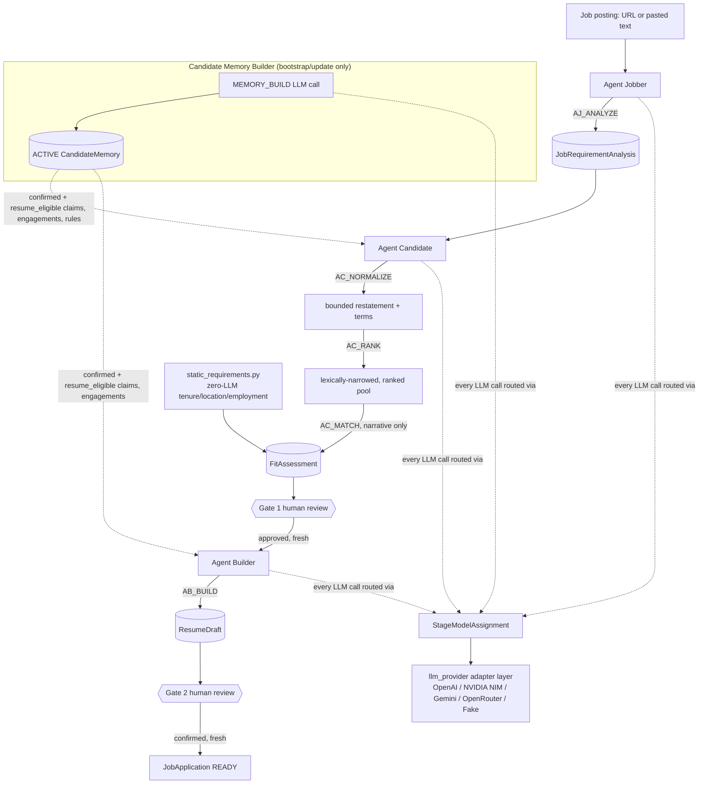

# Architecture (Proposed)

Status: proposed, pre-implementation. This document describes the smallest architecture believed
to satisfy `requirements.md`. Every boundary and component below is connected back to a
requirement ID (see `docs/REQUIREMENT_TRACEABILITY.md` for the full catalog). Items that go beyond
what requirements.md states verbatim are marked **[recommendation — see DECISIONS.md]**; treat
those as proposals, not settled fact.

## 1. Guiding constraint

STACK-001..008 (requirements.md §11) is the starting stack: Django, PostgreSQL via Docker,
server-rendered templates, synchronous execution, Pydantic for structured-output validation,
`.env` secrets, no Redis/Celery, no SPA, no cloud deployment. Nothing below introduces
infrastructure beyond that without a stated reason tied to a requirement ID. In particular:

- **No LangGraph for v1** (D-001 / STACK-006, **APPROVED** 2026-09-02). The two human review
  gates are DB-state preconditions (HITL-004), not paused executions — a graph framework's
  checkpoint/resume machinery would be solving a problem this design doesn't have, and the durable
  business state already belongs in PostgreSQL (`JobApplication` lifecycle, stage artifacts,
  versions, approvals, feedback, freshness, current-version pointers) — a second authoritative
  workflow-state representation through LangGraph checkpoints must not be created alongside it.
  Stage-service boundaries are kept clean specifically so LangGraph, LangChain agents, or the
  OpenAI Agents SDK could be evaluated later without redesigning the domain model. **An explicit
  architecture review checkpoint is scheduled for after the integrated workflow is functioning
  (approximately Milestone M7)** — see §7 below. Observability is designed independently of the
  orchestration framework and is not, on its own, a reason to adopt one of these frameworks (see
  §7).
- **No Celery/Redis** (STACK-003/NG-004). Single operator, one job application in flight, every
  stage already pauses for human review — synchronous in-request LLM calls cost a few seconds of
  latency, which is not a real problem at this scale.
- **No SPA** (STACK-004). Server-rendered Django templates are sufficient for one local operator.

## 2. Component boundaries (Django apps)

Each app is a request-time module with models, one or two services, and (where relevant) views/
templates. No app calls another app's models directly for anything the owning app should be
responsible for validating — cross-app access goes through a small service function, not raw ORM
queries reaching into another app's internals, so that responsibility (e.g. "only confirmed claims
are eligible") lives in exactly one place.

### 2.1 `llm_provider`

**Responsibility**: the entire LLM provider abstraction (requirements.md §9) — registry, adapter
interface, per-provider adapters, structured-output validation scaffolding, retry policy, error
taxonomy, call audit logging. This is the one app every other pipeline app depends on for making
an LLM call; no other app talks to an LLM SDK directly.

**Owns**: `LLMProvider`, `LLMModel`, `StageModelAssignment`, `LLMCallLog` (DATA-008/009), the
`NormalizedLLMRequest`/`NormalizedLLMResult` types (LLM-002), the adapter interface and concrete
OpenAI/NVIDIA-NIM/Gemini adapters (LLM-007), the retry policy (LLM-008), and the typed error
taxonomy (LLM-009).

**Satisfies**: GOAL-002, LLM-001..011, NFR-003/004/005, STACK-005.

### 2.2 `candidate_memory`

**Responsibility**: the memory-build prerequisite (requirements.md §4) — the explicit
`bootstrap_candidate_memory` management command (D-015) that processes the three operator-approved
source files, the ongoing-update workflow (new `OPERATOR_UPDATE` sources + new revisions), content
classification into evidence/constraint/positioning planes (§8), conflict detection, and the full
Candidate Memory UI (overview, source registry, claim review with per-claim supports, conflict
inbox, revision activation, snapshot export — see `docs/IMPLEMENTATION_PLAN.md` M3).

**Owns**: `CandidateMemory`, `MemorySourceDocument`, `MemoryClaim`, `MemoryClaimSupport`,
`CandidateRule`, `MemoryConflict` (DATA-001..003, extended by D-015).

**Satisfies**: MEM-001..006, PIPE-001, GOAL-003 (first review checkpoint — confirming claims *is*
a human-in-the-loop step even though requirements.md doesn't number it as a formal "gate" the way
Gates 1/2 are), D-015 in full.

### 2.3 `job_intake` (Agent Jobber)

**Responsibility**: job posting intake and analysis (requirements.md §5) — URL fetch with
pasted-text fallback, language detection, the AJ LLM call, and storage of the structured
`JobRequirementAnalysis`.

**Owns**: `JobRequirementAnalysis` (DATA-004), its child `JobRequirement` rows with stable IDs
(D-014), the URL-fetch-with-fallback service.

**Satisfies**: AJ-001..006, D-014's AJ portion.

### 2.4 `candidate_matching` (Agent Candidate)

**Responsibility**: retrieval of relevant `MemoryClaim`s and the fit/gap assessment (requirements.md
§6) — the AC LLM call and its output validation (no-concealment check).

**Owns**: `FitAssessment` (DATA-005), its child `RequirementAssessment` rows (D-014), the
retrieval service (queries `candidate_memory` for confirmed claims relevant to a given
`JobRequirementAnalysis`, never the whole profile). **(D-019)** A static, structural requirement
(tenure, dates, location, employment relationship) is assessed locally against `CareerEngagement`
records — no LLM call — via `candidate_memory.services.static_profile_boundary`; only genuinely
narrative fit/gap judgment goes through the AC LLM call.

**Satisfies**: AC-001..003, NFR-002, D-014's AC portion.

### 2.5 `resume_builder` (Agent Builder)

**Responsibility**: positioning and drafting (requirements.md §7) — the AB LLM call, the
post-generation no-fabrication validator, markdown rendering, and versioned `ResumeDraft` storage.

**Owns**: `ResumeDraft` (DATA-007) and its structured `ResumeElement`s (D-014), the no-fabrication
validator, and the markdown renderer defined in `docs/RESUME_OUTPUT_STRUCTURE.md`. **(D-019)** The
AB LLM call never receives or produces employer/title/location/date fields — it selects an
`engagement_id` and writes evidence-backed bullets for it; `candidate_memory.services.
static_profile_boundary.render_engagement_header` renders the actual header exclusively from the
referenced `APPROVED` `CareerEngagement` record.

**Satisfies**: AB-001..004, NFR-001, D-014's AB portion.

**Dependency (resolved)**: D-007 previously blocked this app on an undefined template; that is now
resolved via `docs/RESUME_OUTPUT_STRUCTURE.md`, so this app is unblocked for Milestone M6.

### 2.6 `reviews`

**Responsibility**: the shared mechanics of both human review gates (requirements.md §10) — status
fields, the generic approve action, `ReviewFeedback` storage, and freshness/staleness checks. Kept
as its own app (rather than duplicated inside `candidate_matching` and `resume_builder`) because
HITL-004/005/006/007 describe the *same* mechanism applied at two points in the pipeline; one
implementation avoids two subtly-different copies of gate logic drifting apart.

**Owns**: `ReviewFeedback` (DATA-006), the generic approve/needs_rework view logic, and the
freshness-check helper used at the start of AC's and AB's runs.

**Satisfies**: HITL-001..007, NFR-002 (jointly with `candidate_matching`).

### 2.7 `job_applications` (D-012, **APPROVED** 2026-09-02)

**Responsibility**: the aggregate/root entity for one tracked vacancy/application. Groups the
versioned chain of `JobRequirementAnalysis` → `FitAssessment` → `ResumeDraft` (D-010) via
current-version pointers, owns the dashboard lifecycle (`pipeline_phase`/`application_outcome`,
requirements.md §17), and is the entity the freshness checks in D-006 compare against.

**Owns**: `JobApplication` — `current_jra`, `current_fit_assessment`, `current_resume_draft`
pointers; `pipeline_phase` (`NEW`/`ANALYSIS`/`PREPARATION`/`READY`); `application_outcome`
(`NOT_APPLIED`/`APPLIED`/`INTERVIEWING`/`REJECTED`); `created_at`/`updated_at`. Also owns the
dashboard views/templates (list of job applications, per-application detail linking into the
other apps' screens at that application's current state).

**Satisfies**: the dashboard requirement (requirements.md §17), and is a load-bearing dependency
of D-006's freshness model and D-010's versioning model — not just a UI convenience.

**Sequencing note**: per D-012's own consequence, this app should be established early enough
(Milestone M1 scaffolding, populated starting M4) that `job_intake`, `candidate_matching`, and
`resume_builder` naturally FK into it from the start, rather than retrofitting the aggregate onto
already-built stage models at M7.

### 2.8 Operator UI

No separate `ui` app. Views and templates live inside the owning app for each screen (e.g. the
memory-confirmation screen lives in `candidate_memory`, Gate 1's combined AJ+AC view lives in
`reviews` since it renders records from two other apps but the *gate* itself is `reviews`'
responsibility). This keeps STACK-004's "no SPA" simple without inventing a cross-cutting app that
has no clear ownership.

## 3. Provider abstraction design (detail on LLM-001..011)

No adapter code is written in this phase — this is the design-level contract to be implemented in
M2.

### 3.1 `NormalizedLLMRequest`

Carries: the message/prompt content for the call, the target output schema (a Pydantic model —
see D-005), generation parameters (temperature, max tokens, reasoning/thinking effort where
applicable), and a `stage` identifier (`MEMORY_BUILD` / `AJ_ANALYZE` / `AC_MATCH` / `AB_BUILD`) so
the adapter layer knows which `StageModelAssignment` and which `LLMCallLog` row this call belongs
to.

### 3.2 `NormalizedLLMResult`

Either: parsed structured content (validated against the requested Pydantic schema), usage
metadata (input/cached-input/output/total token counts where reported, latency — token-first per
D-008; no cost computation at M2, pricing is optional/deferred) — or one of the typed errors from
the LLM-009 taxonomy (configuration, auth, rate-limit, timeout, schema-validation,
provider-internal). Pipeline code (the four agent apps) only ever sees this normalized shape; it
never sees a raw provider response object.

### 3.3 Per-provider translation layer

One adapter class per provider, each responsible for exactly the parts of LLM-007 that are
provider-specific:

- **OpenAI adapter**: passes the Pydantic-derived JSON schema through directly as strict
  structured output.
- **NVIDIA NIM adapter**: OpenAI-compatible `response_format`-style schema, but capability
  (whether a given self-hosted/managed model actually supports strict schema mode) must be
  checked against `LLMModel.supports_structured_output` before assuming it, since NIM model
  support is not uniform.
- **Gemini adapter**: translates the Pydantic schema into Gemini's reduced dialect — flattening
  `$ref`/`$defs`, and dropping `enum` constraints from the schema sent to Gemini entirely
  (accumulated enum constraints have been observed elsewhere to cause opaque 400s). Enum-typed
  fields are instead re-validated in Python against the Pydantic model's allowed values after the
  response is parsed. The Gemini adapter is pinned to REST transport, never gRPC (gRPC has been
  observed to reject payloads that succeed over REST with identical content). Thinking-budget/
  reasoning-effort parameters are passed defensively — e.g. never assume a literal zero value is
  accepted for "disabled reasoning" — since these parameters are still evolving across Gemini
  model generations.
- **OpenRouter adapter** (2026-09-04, D-025): an OpenAI-compatible `/chat/completions` endpoint
  that routes to many different underlying models with uneven feature support, so — like NVIDIA
  NIM — it checks `LLMModel.supports_structured_output`/`supports_reasoning` before assuming
  either, rather than trusting the request alone. Reuses the shared OpenAI-compatible request
  body/response parsing wherever the semantics genuinely match; adds only what is genuinely
  OpenRouter-specific: an explicit `stream: false`, the unified `reasoning: {"enabled": true}`
  parameter (sent only when explicitly enabled, never a default), the `provider:
  {"require_parameters": true, "data_collection": "deny"|"allow"}` routing object (the privacy
  policy is a constrained `LLMProvider.data_collection_policy` field, never arbitrary JSON, and
  the adapter fails closed — no HTTP call — if that field is ever an invalid stored value), and
  the two optional attribution headers (`OPENROUTER_HTTP_REFERER`/`OPENROUTER_APP_TITLE`). The
  model id sent is always exactly `LLMModel.model_id` — no fallback to a paid or different model
  exists anywhere in the adapter. **(2026-09-07, D-038, OpenRouter Free Router migration)**: the
  registry can now represent `openrouter/free` — OpenRouter's Free Models Router
  (`https://openrouter.ai/docs/guides/routing/routers/free-router`), a *virtual* router over a
  changing pool of free-tier models rather than one pinned model — using the same `LLMModel` row
  shape, with truthful, conservative capability flags rather than an inferred/inherited ceiling
  (`supports_reasoning=False`, a conservative `max_output_tokens` matched to the smallest
  already-qualified stage budget in this codebase, never assumed from whichever model happens to
  serve a given request). Because the router's selected underlying model can differ call to call,
  `LLMCallLog` gained `resolved_model_id`/`finish_reason` (populated by the shared OpenAI-compatible
  parser from the response body's own `model`/`finish_reason` fields when present, never guessed,
  never overwriting the requested `LLMModel` FK) so a call can be attributed to what actually served
  it, distinct from what was requested; and `LLMModel` gained `is_active` (default `True`) so a
  retired model (e.g. the superseded Z.ai/GLM row) can be excluded from routing
  (`get_adapter_for_stage` raises `InactiveModelAssignedError` for a stage still assigned to an
  inactive model) without deleting it or breaking the historical `LLMCallLog`/`StageModelAssignment`
  rows that reference it (`on_delete=models.PROTECT` on both FKs already guarantees that
  independently). See D-038 in `docs/DECISIONS.md` for the full migration record.

New providers added later implement the same adapter interface and get their own isolated
translation class; no shared pipeline code changes (NFR-005).

### 3.4 Retry policy (LLM-008)

Lives in the adapter layer, not in pipeline code — pipeline code calls the adapter once and gets
back either a result or a (post-retry) typed error; it never sees individual retry attempts.
Retries only fire for errors classified as transient (rate-limit, 5xx/provider-internal), never
for auth or schema-validation errors. For streaming calls specifically: retry only if no output
token has streamed yet for that attempt — once any content has streamed, the adapter must return
whatever partial-failure error it has rather than retrying (to avoid duplicated/garbled output).
Retry attempts are capped with backoff between them.

### 3.5 Error handling and sanitization (LLM-009)

Every typed error carries a safe, human-readable category and message; the adapter layer is
responsible for stripping any raw provider response body or exception text that might echo
request/response content (which can include candidate data) before it reaches `LLMCallLog` or any
log line.

### 3.6 Audit logging (LLM-010)

The adapter's single call path is the one place an `LLMCallLog` row gets written — provider,
model, stage, token usage (input/cached-input/output/total, per D-008's token-first priority),
latency, retry count, sanitized error category. No cost computation happens at M2; if pricing is
added to `LLMModel` later, a `cost_usd` snapshot can be added to this write additively, using the
`LLMModel`'s pricing at call time, without reworking the token fields. Because this write happens
in one place (the adapter layer), no pipeline app has to remember to log a call itself.

## 4. Domain model (semantics, not migrations)

Field lists here are the important fields only, not a final schema — per the task's instruction,
semantics and invariants come first.

### `CandidateMemory` (fields strengthened by D-015, M0.1)
- **Responsibility**: one complete logical revision of the candidate's profile. Each revision is
  a complete logical snapshot (D-002, **APPROVED WITH MODIFICATION**), scoped to what D-015 adds:
  explicit lifecycle status and lineage rather than an implicit "version int only" model.
- **Key fields**: `id` (UUID), `version` (int, monotonic), `status`
  (`BUILDING`/`NEEDS_REVIEW`/`ACTIVE`/`SUPERSEDED`/`FAILED` -- `FAILED` added by D-016, **PROPOSED**,
  not yet product-owner-approved), `base_revision` (optional FK to the prior
  `CandidateMemory` this one incrementally builds on — the D-002 "unchanged documents carry
  forward" comparison is always relative to this pointer, never to "whatever the latest revision
  happened to be" at build time), `created_at`, `activated_at` (nullable — set only when an
  operator explicitly activates the revision, per D-015's bootstrap mechanism), `build_summary`
  (counts: documents processed/reused, claims extracted/carried-forward/unconfirmed, conflicts
  detected/resolved — populated by the bootstrap command or the M3 update workflow, shown in the
  UI per M3 scope).
- **Relationships**: has many `MemorySourceDocument`, has many `MemoryClaim`, has many
  `MemoryConflict` (all scoped to this revision).
- **Lifecycle** (blocking gap closed 2026-09-02 — see `docs/DECISIONS.md` D-015 and the M0.1
  pre-implementation audit): four states, with an explicit mutability boundary between them —
  mutability is not a property of "has this row been created" but of *which state it is in right
  now*.
  - **`BUILDING`**: the bootstrap/update command is ingesting, classifying, and extracting.
    `MemoryClaim`, `MemoryClaimSupport`, and `CandidateRule` rows are created and may still change
    as extraction proceeds. This revision is **not eligible for AC or AB use** — retrieval only
    ever reads from the `ACTIVE` revision.
  - **`NEEDS_REVIEW`**: extraction is complete; operator review is in progress. The operator may
    freely **confirm, correct, retire, or restore** individual `MemoryClaim`s, and **resolve or
    dismiss** individual `MemoryConflict`s, any number of times. Provenance validation
    (`MemoryClaimSupport` quotation/hash checks) and eligibility/classification validation must
    still pass for anything the operator confirms — review does not relax those checks. This
    revision is still **not** the active Candidate Memory and is still not used by AC/AB.
  - **`ACTIVE`**: this is the current operational Candidate Memory — the one
    `candidate_matching`'s retrieval reads from, and the one `docs/CANDIDATE_MEMORY_SNAPSHOT.md`-
    style exports regenerate from. From the moment a revision becomes `ACTIVE`, its factual
    content is **frozen**: claim text, classification (`claim_type`/`resume_eligible`),
    provenance (`MemoryClaimSupport` rows), source associations, `CandidateRule`s, and
    `MemoryConflict` resolutions on this revision do not change again. It may be searched and
    viewed, never edited in place. AC and AB may use only claims on this revision that are both
    `confirmed` and `resume_eligible` (§4/§9). Any further correction, addition, retirement, or
    conflict resolution happens through the ongoing-update workflow, which creates a **new**
    revision (`base_revision` pointing at this one) — it never mutates this one.
  - **`SUPERSEDED`**: a later revision has been activated. A superseded revision remains
    immutable and retained for audit/rollback, exactly like an `ACTIVE` one, just no longer the
    one retrieval reads from. Activating a new revision is the one event that moves the
    previously-`ACTIVE` revision to `SUPERSEDED` — the two transitions (`new → ACTIVE`,
    `old ACTIVE → SUPERSEDED`) happen atomically, together.
  - **`FAILED`** (D-016, **PROPOSED**): a second terminal state, reachable only from `BUILDING` or
    `NEEDS_REVIEW`, never from `ACTIVE`. Reached either by an unexpected failure during the build
    (a genuine bug/outage, not the already-tallied expected per-chunk extraction errors, which
    still leave the revision at `NEEDS_REVIEW`) or by an explicit operator "abandon this working
    revision" action. Like `SUPERSEDED`, it is frozen and never resurrected -- recovery always
    means starting a new revision (`base_revision` still points at whatever was `ACTIVE` at the
    time, exactly as any other new revision would). Before starting a build, the bootstrap
    mechanism refuses outright if a `BUILDING`/`NEEDS_REVIEW` revision already exists, rather than
    silently creating a second one -- an explicit `abandon_existing`/`--abandon-existing` action is
    required to discard the existing one and proceed.

  Put another way: `status` and `activated_at` are not the *only* fields that ever change — claim/
  conflict child records legitimately change throughout `BUILDING`/`NEEDS_REVIEW` — but they are
  the *last* fields to change, and the only ones a completed (`ACTIVE`/`SUPERSEDED`) revision's own
  row can still transition through (`ACTIVE → SUPERSEDED`). Once a revision leaves
  `NEEDS_REVIEW` for `ACTIVE`, nothing about its content changes again, ever.
- **Activation** (explicit operator action, per D-015's bootstrap mechanism and the M3 "explicit
  revision activation" UI action):
  - Activating a revision is always a deliberate operator action — never automatic, and never a
    side effect of the bootstrap/update command finishing.
  - **Exactly one** revision has `status = ACTIVE` at any time; activating one revision and
    superseding the previous one is a single atomic transition (see `SUPERSEDED` above).
  - A revision **must not** be activated if it contains a validation failure that could let
    unsupported or misclassified content become eligible — i.e., every claim currently `confirmed`
    on the revision must actually pass provenance validation (§4's `MemoryClaimSupport` checks)
    and classification validation (§8); a revision with such a failure is blocked from activation
    until fixed, same as any other `NEEDS_REVIEW` item.
  - **Superseded by D-018 (2026-09-03, Candidate Memory recovery)**: this D-015 allowance ("an
    unresolved `MemoryConflict` does not have to block activation, as long as every claim it
    affects stays `BLOCKED_CONFLICT`") is retired. **Every `OPEN` `MemoryConflict` now blocks
    activation outright**, regardless of the eligibility state of its involved claims — the real
    revision-1 bootstrap showed a warning-only conflict was too easy to click past unread. The
    operator must resolve or dismiss each conflict (`services/lifecycle.py::resolve_conflict`/
    `dismiss_conflict`) before activating; there is no "activate with N excluded" path anymore.
  - Activation is also now blocked by (a) any unresolved (`FAILED`) `ChunkExtractionAttempt` — a
    durable per-chunk audit row (revision, source document, source hash, start/end lines, attempt
    number, status `SUCCESS`/`FAILED`/`SUPERSEDED`, sanitized error category, associated
    `LLMCallLog`) recorded for every extraction attempt, including sub-chunk attempts created by
    recursively splitting a chunk that hit `finish_reason=length` — and (b) zero `CONFIRMED`
    `employment_dates`/`employment_location` coverage, unless the caller explicitly passes
    `acknowledge_zero_employment_coverage=True` as a visible operator override.
- **Versioning** (D-002, approved; sources named by D-015): a new revision is a **snapshot +
  incremental** process, not a full reprocess, run against `base_revision`. Source documents are
  matched by immutable content hash (D-003); unchanged documents are not re-sent through
  extraction, and their claims may carry `confirmed` status forward into the new snapshot when
  claim identity is demonstrably unchanged (per the strengthened `MemoryClaim`/`MemoryClaimSupport`
  fields below). New/changed documents are (re)processed, and claims from new/changed material
  begin `unconfirmed`. If claim identity can't be safely established, the claim requires operator
  reconfirmation rather than silently inheriting `confirmed`.

### `MemorySourceDocument` (fields strengthened by D-015, M0.1)
- **Responsibility**: one immutable source occurrence within one `CandidateMemory` revision —
  either one of the three operator-approved bootstrap files (D-015) or one `OPERATOR_UPDATE`
  document created through the M3 UI.
- **Key fields**: `candidate_memory` FK, `logical_source_key` (a stable identifier for "this
  conceptual document" across revisions — e.g. `primary_profile`, `english_corpus`,
  `german_corpus`, or a generated key per `OPERATOR_UPDATE` — this is what D-002's "unchanged
  document" comparison keys off, independent of filename), `filename`, `source_role`
  (`PRIMARY_PROFILE`/`ENGLISH_CORPUS`/`GERMAN_CORPUS`/`OPERATOR_UPDATE` — D-015's source
  precedence categories), `language`, `trust_status` (including `OPERATOR_APPROVED` for the three
  bootstrap files and any operator-entered update — D-015 requires this because bootstrap
  extraction eligibility depends on the *source* being operator-approved, separate from whether
  the *extraction* passes validation), `precedence` (int or enum reflecting D-015's stated order:
  `PRIMARY_PROFILE` highest, then `ENGLISH_CORPUS`, then `GERMAN_CORPUS`; `OPERATOR_UPDATE`
  precedence is highest for its own claims since it's the most recent operator input), `raw_content`,
  `content_sha256` (D-003, approved), `imported_at`, `unchanged_from` (optional FK to the prior
  revision's `MemorySourceDocument` row with the same `logical_source_key` and hash — set when this
  occurrence is carried forward unchanged rather than reprocessed, making the D-002 "unchanged"
  determination an explicit stored fact, not a recomputed one).
- **Relationships**: has many `MemoryClaim` (claims extracted from this occurrence), has many
  `MemoryClaimSupport` rows referencing it.
- **Invariants**: immutable once created. A later revision's occurrence of "the same" conceptual
  document is a new row (matched via `logical_source_key`), never an edit to this one.

### `MemoryClaim` (fields strengthened by D-015, M0.1)
- **Responsibility**: one atomic canonical fact, the atomic unit of retrieval, review, and
  evidence citation.
- **Key fields**: `claim_id` (stable, human-readable — e.g. `MC-0142` — referenced by
  `RequirementAssessment.supporting_memory_claim_ids` and `ResumeElement.supporting_memory_claim_ids`,
  D-014), `candidate_memory` FK, `stable_key` (a cross-revision identity key — distinct from
  `claim_id` — that lets D-002's carry-forward logic say "this is the same claim as one in
  `base_revision`," even if its human-readable `claim_id` were to change; in practice `claim_id`
  and `stable_key` may coincide, but the model keeps them conceptually separate since a claim's
  numbering could need to shift on reprocessing while its identity should not), `canonical_text`
  (**English only**, per D-015 — canonical claims are stored in English regardless of source
  language; German source expressions are attached via `MemoryClaimSupport`, not stored as a
  separate canonical claim), `claim_type` (e.g. role-history, responsibility, delivered-project,
  skill-used, achievement/metric, education, certification, language-proficiency — see the
  evidence-plane list in §8 below), `subject_scope` (employer/project/context this claim is
  about), `experience_level` (`AWARENESS`/`LEARNING`/`PROTOTYPE`/`PROFESSIONAL_DELIVERY`/
  `PRODUCTION_OPERATION`/`ARCHITECTURE_OWNERSHIP`/`LEADERSHIP` — required wherever the source
  material distinguishes depth of experience, per `AC-MEMORY_PROFILE.md` §11's confirmation-level
  framework), `resume_eligible` (bool — a claim can be true and confirmed but still not
  resume-eligible, e.g. a constraint-plane fact; see §8), `confirmation_status`
  (`unconfirmed`/`confirmed`/`retired`/`BLOCKED_CONFLICT` — the last one added by D-015: a claim
  with an unresolved `MemoryConflict` is `BLOCKED_CONFLICT`, structurally distinct from
  `unconfirmed`, so retrieval/evidence code can exclude it by state rather than by joining out to
  conflict records every time), `duplicate_group_key` (groups claims that are the same underlying
  fact expressed differently — e.g. an English bullet and its German counterpart in the source
  corpora — so the build process can present them to the operator as one reviewable item instead
  of duplicates), `valid_from`/`valid_to` (optional — temporal validity, e.g. a role's employment
  dates, when the source supports it).
- **Relationships**: has many `MemoryClaimSupport` (its evidence trail — see below, replacing the
  single `source_document` FK originally sketched); may be `subject` of a `MemoryConflict`; later
  referenced by `RequirementAssessment.supporting_memory_claim_ids` and
  `ResumeElement.supporting_memory_claim_ids` (D-014).
- **Lifecycle**: `unconfirmed` (just extracted) → `confirmed` (operator reviewed and trusts it),
  `retired` (operator rejects it), or `BLOCKED_CONFLICT` (an unresolved conflict makes it
  ineligible regardless of any prior confirmation — see `MemoryConflict` below). Only `confirmed`
  **and** `resume_eligible` claims are usable as `MATCH`/`PARTIAL` evidence in D-014's structured
  outputs; `confirmed` claims that are not `resume_eligible` (constraint-plane facts) may still be
  surfaced to AC/AB as context via `CandidateRule`, not as resume evidence. **This
  `confirmation_status` transition is only ever performed while the owning `CandidateMemory`
  revision is `BUILDING` or `NEEDS_REVIEW`** (see the `CandidateMemory` lifecycle above); once that
  revision is `ACTIVE` or `SUPERSEDED`, every claim on it is frozen — a later correction happens on
  a claim in a *new* revision, never by mutating this one.
- **Invariants (MEM-005/NFR-001)**: every claim must be traceable to at least one
  `MemoryClaimSupport` row — a validator, not prompting alone, enforces this at build time. A
  `resume_eligible` claim with `experience_level` of `AWARENESS` or `LEARNING` must not be
  presented as `PROFESSIONAL_DELIVERY` or higher — this is exactly the awareness-vs-delivery
  distinction `AC-MEMORY_PROFILE.md` §11 exists to enforce, made a schema-level fact instead of a
  prompt-level hope.
- **Provenance**: see `MemoryClaimSupport` below — a claim's provenance is the union of its
  support rows, not a single FK.

### `MemoryClaimSupport` (new entity, D-015/M0.1 — replaces the one-source-FK-only model)
- **Responsibility**: one exact supporting passage for one canonical claim. A canonical claim can
  have multiple supports (e.g. an English primary passage plus a German corroborating passage),
  which the single-FK model in the M0 baseline could not represent.
- **Key fields**: `memory_claim` FK, `memory_source_document` FK, `quotation` (exact verbatim
  text), `start_line`/`end_line` (D-003's deterministic line range, preserved unchanged),
  `quotation_hash` (integrity check that the stored quotation still matches the named line range
  in the source document's immutable content — catches a build-time bug or data-migration error,
  not a substitute for the source document's own `content_sha256`), `source_language`, `support_role`
  (`PRIMARY`/`CORROBORATING`/`GERMAN_EXPRESSION`).
- **Invariants (preserves D-003)**: `quotation` must be an exact substring of the referenced
  `MemorySourceDocument.raw_content` at `start_line`/`end_line` — enforced by a validator, not
  trusted from the LLM extraction alone. Loose semantic or embedding similarity is explicitly not
  a provenance mechanism, for the same reason D-003 originally excluded it: a similarity score
  cannot prove the source actually said this, only that it said something in the neighborhood. Like
  its parent `MemoryClaim`, a support row is only ever added or changed while the owning
  `CandidateMemory` revision is `BUILDING`/`NEEDS_REVIEW`; once `ACTIVE`/`SUPERSEDED`, it is frozen.

### `CandidateRule` (new entity, D-015/M0.1)
- **Responsibility**: represents the **constraint plane** and the **positioning plane** (§8) —
  non-factual but operationally important content that is not itself resume evidence:
  cautions, prohibitions, wording preferences, positioning guidance, and learning-status notes
  drawn directly from sources like `AC-MEMORY_PROFILE.md` §9 ("Claims to Use Carefully") and §10
  ("Resume Tailoring Rules").
- **Key fields**: `rule_type` (`CAUTION`/`PROHIBITION`/`PREFERENCE`/`POSITIONING`/
  `LEARNING_STATUS`), `text`, `source` (provenance — typically a `MemoryClaimSupport`-shaped
  pointer into the same source documents, since rules need the same "where did this come from"
  discipline as claims), `scope` (optional — e.g. a rule may apply only to a specific
  `subject_scope` or only to German-language output).
- **Invariants**: a `CandidateRule` is never itself resume evidence and can never independently
  satisfy a `RequirementAssessment` disposition of `MATCH` **or `PARTIAL`** (D-014) — only a
  `confirmed`/`resume_eligible` `MemoryClaim` can support either of those two dispositions.
  Relevant rules must still accompany retrieved claims when AC or AB needs them (e.g. "don't claim
  Go experience beyond 'currently learning'" must reach AB whenever a Go-related claim or job
  requirement is in play), per the runtime-context boundaries in §9.

### `MemoryConflict` (new entity, D-015/M0.1)
- **Responsibility**: represents a detected contradiction between claims/supports (e.g. differing
  German-proficiency-level statements, or differing employment-date ranges across source
  documents) explicitly, rather than silently picking one version.
- **Key fields**: `conflict_key`, `description`, `involved_claims`/`involved_supports` (the
  conflicting evidence), `status` (`OPEN`/`RESOLVED`/`DISMISSED`), `operator_resolution` (free
  text explaining the operator's decision), `resolved_claim` (optional FK — the canonical claim
  the operator confirms once resolved, if resolution converges on one), `resolved_at`.
- **Invariants**: while `status = OPEN`, every `MemoryClaim` referenced by `involved_claims` is
  ineligible for AC/AB use — its `confirmation_status` reads as `BLOCKED_CONFLICT` regardless of
  any prior `confirmed` state. This is what makes D-015's bootstrap rule ("contradictory claims
  remain ineligible and unconfirmed until the operator resolves them") a database-enforced fact,
  not a build-time-only check that could be bypassed by a later direct edit. `status` and
  `operator_resolution` may change freely while the owning `CandidateMemory` revision is
  `BUILDING`/`NEEDS_REVIEW`. A revision **may** still be activated with a `MemoryConflict` left
  `OPEN`, provided every claim it affects remains `BLOCKED_CONFLICT` (see the `CandidateMemory`
  "Activation" rules above) — the activation UI must warn the operator this is happening. Once the
  revision is `ACTIVE`/`SUPERSEDED`, this conflict record is frozen like everything else on that
  revision; resolving it thereafter means creating a new revision, not editing this row.

### `CareerEngagement` (new entity, D-019 — the deterministic static-profile boundary)
- **Responsibility**: one operator-owned, structured record of a real employment/client
  engagement. Employment identity, organisation, title, location, and dates are facts the operator
  approves directly here — never generated, rewritten, or inferred by an LLM, and never part of
  the planned M5/M6 input or output schema (see `services/static_profile_boundary.py`).
- **Key fields**: `engagement_id` (stable, auto-assigned, e.g. `CE-0001`), `legal_employer`,
  `client_organization` (blank when there is no separate client), `default_displayed_organization`,
  `approved_role_title`, `localized_titles` (optional operator-approved translations, never
  machine-translated at render time), `location`, `start_year`/`start_month`, `end_status`
  (`KNOWN`/`PRESENT`/`UNKNOWN`) with `end_year`/`end_month` when `KNOWN`, `presentation_mode`
  (`CLIENT_CENTRIC`/`LEGAL_EMPLOYER_EXPLICIT`/`COMBINED` — same vocabulary as
  `MemoryClaim.presentation_mode`), `approval_status` (`DRAFT`/`APPROVED`/`REJECTED`),
  `created_at`/`updated_at`.
- **Deliberately not a `_RevisionScopedModel`**: not re-extracted per `CandidateMemory` revision
  and not frozen by that revision's own lifecycle — gated by its own `approval_status` instead,
  following the same admin-editable-registry pattern as `llm_provider`'s `LLMProvider`/`LLMModel`.
- **Derived behavior (all deterministic, no LLM call)**: `duration_months()` (a missing month
  component is treated as January for a start date / December for an end date — a disclosed
  rounding convention, not a hidden guess; returns `None`, never `0`, when `end_status=UNKNOWN`),
  `is_current` (`end_status=PRESENT`), `displayed_organization` (selects among this record's own
  stored alternatives per `presentation_mode` — never computes or invents a new name),
  `title_for_language(code)` (a stored `localized_titles` entry, or else `approved_role_title` —
  never machine-translated). `services/career_engagement.total_non_overlapping_experience_months`
  merges overlapping engagements' date ranges so concurrent roles are never double-counted.
- **Invariant**: only an `APPROVED` `CareerEngagement` may ever be rendered or referenced by a
  future M6 output (`services/static_profile_boundary.resolve_approved_engagement`) — an unknown or
  unapproved `engagement_id` fails validation outright.

### `ClaimEngagementMapping` (new entity, D-019)
- **Responsibility**: a reviewable link between one `MemoryClaim` and one `CareerEngagement`.
  Deliberately a **separate table**, never a field on `MemoryClaim` itself — proposing, approving,
  or rejecting a mapping never mutates a `MemoryClaim` row, so it never conflicts with
  `_RevisionScopedModel`'s ACTIVE-revision-content-freeze invariant; a claim belonging to an
  already-`ACTIVE` revision can still be mapped to an engagement afterward, exactly like
  `MemoryConflict.involved_claims` already references frozen claims without editing them.
- **Key fields**: `memory_claim` FK, `career_engagement` FK, `status`
  (`PROPOSED`/`APPROVED`/`REJECTED`), `proposed_reason`, `created_at`, `reviewed_at`.
- **Mechanism (`services/engagement_mapping.py`)**: `propose_claim_engagement_mappings` proposes a
  mapping only on an exact, normalized match between a claim's `legal_employer`/
  `client_organization` (or, failing that, its `subject_scope`) and an `APPROVED` engagement's own
  fields — never fuzzy/embedding similarity. Zero matches or more than one candidate match is left
  **unresolved** for the operator, never guessed; idempotent — an existing `(claim, engagement)`
  mapping row is never duplicated. No source document is ever re-extracted to produce a mapping.

### `JobRequirementAnalysis`
- **Responsibility**: Agent Jobber's structured output for one job posting.
- **Key fields**: `source_type` (`url`/`pasted`), original raw text/URL, mandatory requirements,
  preferred requirements, responsibilities, ATS keywords, screening risks, implied expectations.
- **Child entity `JobRequirement`** (D-014, approved): one stably-identified requirement within
  this immutable JRA version — `requirement_id` (e.g. `JR-001`), `category`
  (mandatory/preferred/responsibility/ATS-signal/implied-expectation), `text`, source/context. The
  ID is what `RequirementAssessment` and `ResumeElement.matched_job_requirement_ids` reference —
  it never changes within a version.
- **Versioning** (D-010, approved): gains a `version` int; a re-run triggered by Gate-1 feedback
  targeting AJ creates a new version rather than overwriting; grouped under one `JobApplication`
  (D-012) via `JobApplication.current_jra`.
- **Invariants**: always stores the original raw input (AJ-005), regardless of how many versions
  exist, so every version remains traceable to the same source posting. `JobRequirement` IDs are
  stable and immutable within a version — a re-run creates a new JRA version with its own
  (possibly renumbered) `JobRequirement` set, not a mutation of the old one's IDs.
- **Deterministic integrity gate (D-022/D-023)**: `job_intake/validators/integrity.py` sits between
  AJ's structured-output call and persistence, checking only objective properties — at least one
  requirement exists, no exact-duplicate requirement, and every requirement/screening-risk claiming
  posting support has a verifiable exact-substring quotation. It never judges wording or meaning
  (no phrase blocklist, no posting-length "substantive" heuristic) — per the product-owner boundary
  recorded in D-023, semantic interpretation belongs to the AJ LLM and, at Human Review Gate 1, the
  operator; deterministic code protects only truth (provenance), structural boundaries (schema/ID
  integrity), and lifecycle (atomic persistence, pipeline advancement gating).

### `FitAssessment`
- **Responsibility**: Agent Candidate's structured output — the fit/gap picture for one
  `JobRequirementAnalysis` version.
- **Key fields**: FK to `JobRequirementAnalysis` (specific version), matched-requirements list
  (each referencing the supporting `MemoryClaim`(s)), explicit gaps list, risk notes carried from
  AJ.
- **Child entity `RequirementAssessment`** (D-014, approved; evidence shape extended by D-019): one
  row per relevant `JobRequirement` — `requirement_id`, `disposition`
  (`MATCH`/`PARTIAL`/`GAP`/`UNKNOWN`), `supporting_memory_claim_ids`, **`supporting_engagement_ids`
  (D-019)**, `explanation`, `gap_or_limitation`. This *replaces* a purely free-form gaps/matches
  representation — every relevant `JobRequirement` gets exactly one disposition row, so coverage is
  enumerable and checkable, not just narratively described. A **static, structural** requirement
  (tenure, dates, location, employment relationship) is assessed **locally, without an LLM call**,
  purely from `CareerEngagement`'s own stored/derived fields (`services/static_profile_boundary.
  assess_tenure_requirement_locally`/`assess_location_requirement_locally`) and cited via
  `supporting_engagement_ids` alone — no narrative `MemoryClaim` is needed for that disposition.
- **Versioning** (D-010, approved): versioned like `JobRequirementAnalysis`; a Gate-1 feedback
  re-run targeting AC creates a new version.
- **Invariants (NFR-002/D-014)**: every relevant `JobRequirement` has exactly one
  `RequirementAssessment`; `MATCH`/`PARTIAL` require at least one `confirmed` supporting
  `MemoryClaim`; `GAP`/`UNKNOWN` remain explicitly visible and are never silently dropped or
  upgraded to `MATCH` for lack of evidence. Checked by a validator, not left to prompting.
- **Freshness** (HITL-007/D-006, approved): stores `based_on_jra_id`; it is stale whenever that no
  longer equals `JobApplication.current_jra_id` — an **immutable-identity** comparison, not a
  timestamp comparison. On mismatch, the next step must block with an explicit operator prompt.

### `ReviewFeedback`
- **Responsibility**: the operator's free-text input at a review gate, and the trigger for a
  re-run.
- **Key fields**: free text, `target_step` (`AJ`/`AC`/`AB`), FK to the specific record version the
  feedback is about, timestamp.
- **Lifecycle**: a write to this table (HITL-006) is the mechanism that flips the target record's
  status to `needs_rework`; the next pipeline invocation for that step reads status fresh and
  incorporates the feedback as additional input.

### `ResumeDraft`
- **Responsibility**: Agent Builder's output — a structured resume representation, rendered to
  markdown only after validation (see `docs/RESUME_OUTPUT_STRUCTURE.md`).
- **Key fields**: FK to `FitAssessment` (specific version), the structured representation
  (`TargetPositioning`, `ProfessionalSummary`, `ExperienceSection`s, `PositioningTheme`s,
  `Achievement`s, `SkillCategory`/`SelectedResumeSkills`, `Certification`s,
  `LanguageProficiency`s, `PositioningGuidance` — see `docs/RESUME_OUTPUT_STRUCTURE.md`), the
  rendered markdown content (produced only after validation passes), `status`
  (`draft`/`awaiting_review`/`confirmed`), `confirmed_at`.
- **Child entity `ResumeElement`** (D-014, approved): every factual structured item (summary
  statement, experience bullet, achievement, skill, certification, language entry) is a
  `ResumeElement` — `text`, `supporting_memory_claim_ids`, `matched_job_requirement_ids`. **(D-019)**
  An `ExperienceSection`'s employer/title/location/dates are never part of this structured output at
  all — it carries only an `engagement_id` (referencing an `APPROVED` `CareerEngagement`) plus its
  `ResumeElement` bullets; the deterministic renderer resolves the static fields exclusively from
  that engagement record (`services/static_profile_boundary.render_engagement_header`), never from
  anything Agent Builder generated. See `docs/RESUME_OUTPUT_STRUCTURE.md` §2.C/§3/§4.
- **Versioning** (D-010, approved — consolidates the former D-013): each Gate-2 regeneration
  produces a new version; the operator-approved one is flagged `confirmed` as the final
  deliverable for that `JobApplication` (`JobApplication.current_resume_draft`).
- **Invariants (NFR-001/D-014)**: every `ResumeElement` must reference at least one `confirmed`
  `MemoryClaim` reachable through the `FitAssessment` it was built from; every referenced claim ID
  must exist, be confirmed, and be eligible for this `CandidateMemory` revision and job-application
  context — enforced by a post-generation validator against the *structured* representation,
  **before** markdown is rendered. This is an evidence-attachment/eligibility check, not a
  text-similarity check (semantic/embedding similarity is explicitly not the truth test — see
  D-014). Human review at Gate 2 remains responsible for judging whether the wording fairly
  represents the evidence. **(D-019)** Every `ExperienceSection.engagement_id` must resolve to an
  `APPROVED` `CareerEngagement` — an unknown or unapproved ID fails this same validator, exactly
  like a fabricated claim ID.
- **Freshness** (HITL-007/D-006, approved): stores `based_on_fit_assessment_id`; it is stale
  whenever that no longer equals `JobApplication.current_fit_assessment_id` — the same
  immutable-identity comparison `FitAssessment` uses against `JobRequirementAnalysis`.

### `LLMProvider`
- **Responsibility**: one configured LLM backend (e.g. "OpenAI account A").
- **Key fields**: name, base URL, a *reference* to where its credential lives (an env var name),
  never the credential value itself (LLM-004/NFR-003).

### `LLMModel`
- **Responsibility**: one usable model under a provider.
- **Key fields**: FK `LLMProvider`, model identifier, capability flags (structured-output support,
  streaming support, reasoning support, max output tokens — LLM-005/D-009, approved as-is). No
  pricing fields at M2 (D-008, **APPROVED WITH REPRIORITIZATION** — token consumption is the v1
  priority; pricing is optional/deferred and, if added later, must not require reworking
  `LLMCallLog` — see below). **(2026-09-07, D-038)** `is_active` (default `True`) — a retired model
  is deactivated, never deleted; `get_adapter_for_stage` refuses to route a stage still assigned to
  an inactive model, so retirement can never be silently bypassed by a stale assignment.

### `StageModelAssignment`
- **Responsibility**: maps a pipeline stage (`MEMORY_BUILD`/`AJ_ANALYZE`/`AC_MATCH`/`AB_BUILD`) to
  the `LLMModel` currently handling it.
- **Invariants (LLM-001/006)**: changing this mapping is the *only* action needed to move a stage
  to a different provider/model — no pipeline code reads provider identity any other way.
- **(2026-09-07, D-039) `default_reasoning_effort`**: a blank-or-`ReasoningEffort` `CharField`
  alongside `model` — the stage's default reasoning effort, resolved by the same
  `get_adapter_for_stage` call that resolves the model, with the same override/default/no-fallback
  precedence. Blank means "send no reasoning request"; `ReasoningEffort.NONE` is a different, real
  value that explicitly disables reasoning on a reasoning-capable model. `clean()` rejects a
  non-blank, non-`NONE` value unless `model.supports_reasoning` is `True`.

### `LLMCallLog`
- **Responsibility**: one row per LLM call — the audit ledger (not a cache; never read from to
  skip a call).
- **Key fields**: provider, model, stage, token usage — **(D-008, approved, token-first)** input
  tokens, cached-input tokens, output tokens, and total tokens, each where reported by the
  provider — latency, retry count, sanitized error category. No `cost_usd` field at M2; if pricing
  is added to `LLMModel` later, a `cost_usd` snapshot column can be added to this model additively
  without reworking its token fields.
- **Invariants (LLM-009)**: never stores a raw provider response body or unsanitized exception
  text.
- **Aggregation (NFR-004)**: must support summing token counts per `JobApplication`, per pipeline
  stage, per provider, and per model without extra instrumentation beyond this table.
- **(2026-09-07, D-038) Requested-vs-resolved model auditing**: `resolved_model_id`/`finish_reason`
  record what the provider's own response reported for a given call — relevant for a virtual
  router (e.g. `openrouter/free`) whose selected underlying model can vary call to call and is
  otherwise unobservable. Populated only when the response reports them, never guessed, and never
  substituted for `model` (the requested `LLMModel` FK, which always stays exact).
  **(2026-09-07, D-039)** `correlation_id` is now populated by every pipeline call site as
  `str(job_application.pk)` once a `JobApplication` exists (every call except the very first Agent
  Jobber analysis for a brand-new application, which has no id yet) — the M5/M6 stage console
  (§9a.4a) uses it to scope attempt history to one application. `reasoning_effort` (also new)
  records the resolved `ReasoningEffort` value actually sent for that call, mirroring
  `selection_source`'s audit role for the model; blank means no `reasoning` key was sent at all.

### Per-run model selection (2026-09-07, D-038 update)

`StageModelAssignment` remains the *global default* for a stage — it never represents an
individual run's selection. A separate, additive mechanism layers a per-run override on top of it,
with a fixed precedence and no hidden fallback of any kind:

1. an explicit, currently-eligible model selected for this one run (an operator override submitted
   through the AJ/AC/AB UI);
2. otherwise the stage's `StageModelAssignment` (the global default);
3. otherwise a typed, actionable `NoStageDefaultConfiguredError` — never a hard-coded
   provider/model.

- **`llm_provider/services/eligibility.py`**: `eligible_models_for_stage(stage)` is the *one*
  shared source of truth both the AJ/AC/AB UI and the execution path consult — a model is
  selectable only if its provider is active (`LLMProvider.is_active`, new field), the model itself
  is active, it declares the capability the stage requires (structured output, for every stage
  implemented today), its provider has a configured credential *reference* (never the credential
  value), and it is not the FAKE provider type outside a test run. A model can therefore never
  appear in a selector but be rejected at execution time, or vice versa, because there is only one
  function deciding eligibility, not two that could drift apart. Adding a future paid model
  (OpenRouter or a direct provider) requires only a truthful, active registry row — zero change to
  this module, to AJ/AC/AB forms, to templates, or to any pipeline service.
- **`llm_provider/services/model_selection.py`**: `resolve_stage_model(stage,
  requested_model_id=None)` implements the three-step precedence above, returning which `LLMModel`
  was selected and whether the source was the stage default or an explicit override.
  `llm_provider.adapters.get_adapter_for_stage` gained an optional `requested_model_id` keyword
  argument that delegates to this resolver — every existing call site that never passes it behaves
  exactly as before. The resolved model is validated and looked up *before* any provider HTTP call,
  so an ineligible/unavailable selection fails closed with no network request ever made.
- **Audit trail**: `LLMCallLog.model` (pre-existing) already records the exact requested model;
  the new `LLMCallLog.selection_source` (`DEFAULT`/`OVERRIDE`) records *why* it was requested — from
  the stage's configured default, or from an explicit per-run choice — distinct from the
  pre-existing `resolved_model_id`, which continues to record what OpenRouter's free router
  actually routed the call to. These three facts (requested model, why it was requested, what
  actually served it) are never conflated. An override is resolved and persisted at call time only
  — it never mutates the stage's `StageModelAssignment`, so a later change to the global default
  can never rewrite an earlier run's own recorded selection, and a rerun/resumption of that same
  run continues to use the same requested model unless an operator deliberately changes the
  selection before triggering a new run.
- **UI**: `job_intake`'s intake form (`AJ_ANALYZE`) and `reviews`' Gate 1
  (`AJ_ANALYZE`/`AC_NORMALIZE`/`AC_RANK`/`AC_MATCH` — one selector per independently-routed call,
  since Agent Candidate makes three separate LLM calls) and Gate 2 (`AB_BUILD`) pages each gained a
  selector defaulting to "System default", built fresh from `eligible_models_for_stage` on every
  request, marking the current default `[Default]`. Model selection is orthogonal to, and never
  bypasses, the approval/evidence/no-fabrication/staleness gates those views already enforce — it
  controls routing only, never authorizes generation or approval.
- **(2026-09-07, D-039) Reasoning effort uses this identical mechanism**: every selector above
  gained a parallel reasoning-effort `<select>`, `resolve_stage_model`/`get_adapter_for_stage`
  gained a `requested_reasoning_effort` parameter with the same three-step precedence, and
  `ReasoningNotEligibleForStageError` is the reasoning-specific typed failure (raised when the
  resolved effort is incompatible with whichever model actually resolved, whether that
  incompatibility came from an explicit override or from the stage's own configured default paired
  with an overridden model). See §9a.4/§9a.4a for the full runtime picture.

### `JobApplication` (D-012, **APPROVED** 2026-09-02)
- **Responsibility**: the aggregate/root entity for one tracked vacancy/application — groups the
  versioned chain of `JobRequirementAnalysis` → `FitAssessment` → `ResumeDraft` (D-010) and owns
  the dashboard lifecycle (requirements.md §17).
- **Key fields**: `current_jra` FK, `current_fit_assessment` FK, `current_resume_draft` FK,
  `pipeline_phase` (`NEW`/`ANALYSIS`/`PREPARATION`/`READY`), `application_outcome`
  (`NOT_APPLIED`/`APPLIED`/`INTERVIEWING`/`REJECTED`), `created_at`/`updated_at`.
- **Lifecycle**: `pipeline_phase` advances automatically based on workflow state (NEW → ANALYSIS
  once AJ/AC work starts or Gate 1 is pending → PREPARATION once Gate 1 is approved and resume
  work is under way → READY once a resume is approved but not yet marked applied), so the operator
  is not doing repetitive manual status maintenance. `application_outcome` is operator-set
  explicitly (particularly to mark `APPLIED`/`INTERVIEWING`/`REJECTED`) and is independent of
  `pipeline_phase` — regenerating a resume after `APPLIED` does not revert the outcome.
- **Invariants**: this is the single source of "current version" truth that D-006's freshness
  checks and D-010's versioning model both depend on — no other model duplicates that state.
- **Revising a `READY` application (D-035 investigation, 2026-09-06; corrected D-037,
  2026-09-07)**: generating a new version from an application already at `READY` needs no new
  schema/state — it reuses the existing `PipelinePhase` enum. `job_applications.services.
  begin_new_version_from_ready`/`JobApplication.begin_revision_from_ready` is the canonical,
  explicit-authorization entry point. **D-037 correction**: D-035/D-036's first version of this was
  a precondition checkpoint that mutated nothing itself (an audited no-op, not a real, invokable
  action). It is now a real, guarded `READY -> ANALYSIS` transition — atomic,
  `select_for_update()`-locked exactly like `approve_gate1`/`approve_gate2`, refusing
  (`StaleAssessmentError`) to run against a chain already stale relative to an upstream change.
  Touches only `pipeline_phase`; every current-version pointer and `application_outcome` are left
  exactly as they stood at `READY`. Every actual state change afterward still reuses the existing,
  already-hardened machinery unchanged: `reviews.services.run_agent_candidate`/
  `submit_gate1_feedback` (new append-only `FitAssessment` version — cannot reach Agent Builder
  until Gate 1 re-approves, since `build_resume_draft` refuses to run while `pipeline_phase` is
  `ANALYSIS`), `JobApplication.approve_gate1` (D-006 freshness; now genuinely fires its real
  `ANALYSIS -> PREPARATION` transition again, since the phase actually moved), `reviews.services.
  run_agent_builder`/`submit_gate2_feedback` (new append-only `ResumeDraft` version), and
  `JobApplication.approve_gate2` (D-006 freshness against the *new* `FitAssessment`, refusing to
  reconfirm a stale draft, now genuinely firing `PREPARATION -> READY` again). No function anywhere
  sets `pipeline_phase` directly outside these guarded methods. A POST-only, CSRF-protected,
  explicitly-confirmed UI control (`job_applications:begin_revision`) lets an operator invoke this
  from the `READY` application detail page. See `docs/DECISIONS.md` D-035/D-037 and
  `job_applications/tests/test_revision_workflow.py` for the full synthetic-data proof (never
  `JobApplication` 9).

## 5. What is explicitly NOT built (and why)

- No Celery/Redis/message broker (STACK-003, NG-004) — synchronous calls are cheap enough at this
  scale and every stage already pauses for a human anyway. requirements.md §11 notes one possible
  future exception: "a simple DB-row-claiming worker (no broker needed)" if the UI ever needs to
  stay responsive during a long call — this is a future option, not adopted now, and would not
  require Redis/Celery even if it is adopted later.
- No LangGraph (D-001) — gates are DB preconditions, not paused executions; nothing here needs
  checkpointed resumability.
- No SPA/JS framework (STACK-004) — one local operator does not need a rich client.
- No auth/multi-tenancy (NG-002, ACTOR-001) — single operator, single candidate.
- No PDF/DOCX rendering (NG-001, AB-004) — markdown is the v1 deliverable.
- No cassette/recorded-response test infrastructure yet (NG-003, TEST-002) — deferred until
  outputs stabilize; the adapter interface (§3) is kept as the one seam so this can be added later
  without touching pipeline call sites.
- No shared/extracted provider-adapter package (LLM-011) — this codebase is fully independent of
  `career-intelligence`; the interface is kept clean enough that a future extraction wouldn't
  require a rewrite, but no such extraction happens now.
- No LangChain/LangGraph/LangSmith/OpenAI Agents SDK during M1/M2 (D-001) — not merely deferred by
  default but explicitly re-evaluated only at the post-M7 checkpoint in §7 below, and never
  adopted for observability reasons alone.
- No removal of Django's own admin/auth framework. **(v1.1 clarification)** requirements.md's "no
  multi-tenant auth" non-goal is about product-level accounts/tenants/roles, not about
  `django.contrib.admin`/`auth`/`sessions`/`contenttypes`, which M1 includes as standard framework
  infrastructure needed for provider/model registry administration (see §2.6 and D-012's
  dashboard, both of which assume the Django admin is present).

## 6. Structured AJ → AC → AB traceability design (D-014)

This section details the design behind requirements.md's new §16 and `docs/DECISIONS.md` D-014 —
the mechanism that makes the no-concealment (NFR-002) and no-fabrication (NFR-001) invariants
checkable in code.

- **`job_intake`** owns `JobRequirement` rows scoped to one `JobRequirementAnalysis` version, each
  with a stable `requirement_id` (`JR-001`, ...) and `category`. These IDs are immutable within a
  version; a re-run creates a new JRA version with its own `JobRequirement` set (§4).
- **`candidate_matching`** owns `RequirementAssessment` rows scoped to one `FitAssessment` version
  — one row per relevant `JobRequirement`, each with a `disposition` and, for `MATCH`/`PARTIAL`,
  `supporting_memory_claim_ids` restricted to `confirmed` claims. A validator (not the LLM prompt
  alone) enforces "every relevant requirement has exactly one disposition" and "no unevidenced
  `MATCH`" at the point this data is persisted, per D-014.
- **`resume_builder`** owns `ResumeElement`-shaped structured data (see
  `docs/RESUME_OUTPUT_STRUCTURE.md`) for every factual output; the no-fabrication validator runs
  against this structured data before the markdown renderer is ever invoked. The validator checks
  claim existence, confirmation, revision-eligibility, and job-application-context eligibility —
  an attachment/eligibility check, deliberately not a text- or embedding-similarity check (D-014
  rules that out as the fundamental truth test, precisely because similarity checks can be fooled
  by a plausible-sounding but unevidenced rewrite).
- **Human review boundary**: none of this validation judges whether generated wording is a fair,
  accurate representation of the cited evidence — that stays a Gate 1/Gate 2 human review
  responsibility. The structural validators only guarantee that every factual claim has *some*
  named, checkable evidence trail; they do not (and cannot) guarantee the trail is used honestly in
  prose. This split is deliberate, not a gap: it is exactly what "the operator remains responsible
  for approving final wording" (requirements.md §16) means architecturally.

## 7. Observability and future orchestration-framework compatibility

Companion detail to D-001's re-evaluation checkpoint (§1).

- `LLMCallLog` (§4) remains the durable **application** audit ledger — provider, model, stage,
  token usage, latency, retries, sanitized error category — and application correctness must never
  depend on a third-party tracing backend being present.
- The natural future instrumentation boundary, if tracing is added later, is around each stage
  invocation's internal steps: deterministic validation → provider call → retry → structured
  parsing → persistence, scoped under one `JobApplication`. Because stage-service functions are
  already clean, isolated call boundaries (§2), a tracing library (e.g. LangSmith or another
  backend) could wrap those boundaries later without the application's correctness depending on
  it being present.
- **Post-M7 checkpoint** (D-001): once the integrated per-job workflow (M7) is functioning,
  explicitly revisit whether concrete needs have emerged that justify an orchestration/agent
  framework — dynamic agent routing, parallel branches, tool-calling loops, long-running
  autonomous execution, resumability after process failure, agent-to-agent delegation,
  significantly more pipeline stages, or complex conditional execution. Wanting better
  observability/tracing is explicitly **not**, by itself, sufficient justification — observability
  is addressed independently, as described above.

## 8. Content classification: evidence / constraint / positioning planes (D-015, M0.1)

The Memory Build importer (and the ongoing-update workflow, both in `candidate_memory`, M3) must
not flatten every markdown bullet in a source document into a resume-eligible `MemoryClaim`. The
source corpora (`AC-MEMORY_PROFILE.md`, `AC-profile_english.md`, `AC-profile_german.md`) mix three
fundamentally different kinds of content, and conflating them is exactly the failure mode D-015
exists to prevent:

1. **Evidence plane** — role history, responsibilities actually performed, delivered projects,
   skills actually used, supported achievements and metrics, education, certifications, language
   proficiency. These *may* become resume-eligible `MemoryClaim`s (`resume_eligible = true`),
   subject to the usual confirmation and no-fabrication discipline.
2. **Constraint plane** — awareness-only limitations, "currently learning" notes, explicit
   prohibitions against overclaiming, lack of formal ownership, safe-wording restrictions (see
   `AC-MEMORY_PROFILE.md` §9 "Claims to Use Carefully" and §11's confirmation-level rules). These
   become `CandidateRule`s (or a `MemoryConflict`/limitation record when they describe a genuine
   contradiction) and can never independently support a `MATCH` disposition (D-014).
3. **Positioning plane** — suggested target titles, alternative summaries, company-specific fit
   statements, resume ordering guidance, target-role keywords, instructions such as "emphasize X"
   (the bulk of what fills `AC-profile_english.md`/`AC-profile_german.md`, which are consolidated
   *tailored-resume inputs*, not clean evidence lists). These may guide tailoring — surfaced as
   `CandidateRule`s with `rule_type = POSITIONING` — but are never factual evidence and must never
   be stored as a `MemoryClaim`.

This is also where D-015's job-title-vs-positioning distinction lives concretely: an actual
employment title (e.g. "System Engineer" at Continental, evidence plane) and a suggested target
title for a specific past application (e.g. "Senior Solutions Architect," positioning plane) are
different `claim_type`/`rule_type` values, never merged, and a positioning-plane title must never
be written into a `MemoryClaim.canonical_text` as if it were historical fact.

Classification is a build-time validation concern, not merely a prompting concern: the schema
distinguishes `MemoryClaim` (evidence, potentially resume-eligible) from `CandidateRule`
(constraint/positioning, never resume-eligible) precisely so a downstream bug can't accidentally
treat a positioning suggestion as a factual claim.

## 9a. Runtime agents and LLM stages (operational summary, 2026-09-05)

This section is the single consolidated map of what actually runs at request time. It
cross-references the per-app detail in §2 and the per-provider detail in §3 rather than
restating it — read this section for "which agent, which stage, which gate, in what order,"
and §2/§3 for the design rationale behind each piece.

**Live provider/model assignments and output-token/timeout budgets are operational data, not
architecture** — they change by admin action, not by code change, and are tracked in
`docs/CURRENT_STATE.md` (the "What exists" / decision sections), never hardcoded here.

### 9a.1 The four runtime agentic components

| Component | App | Responsibility |
| --- | --- | --- |
| **Candidate Memory Builder** | `candidate_memory` | Turns the operator-approved source documents into the versioned, reviewable `CandidateMemory` (§2.2, §8). Runs only during an explicit bootstrap/update command invocation — never per job application. |
| **Agent Jobber (AJ)** | `job_intake` | Turns one job posting (URL or pasted text) into a structured, stably-IDed `JobRequirementAnalysis` (§2.3). |
| **Agent Candidate (AC)** | `candidate_matching` | Retrieves a bounded, relevant slice of the `ACTIVE` CandidateMemory and produces a per-requirement fit/gap `FitAssessment` (§2.4, §9). |
| **Agent Builder (AB)** | `resume_builder` | Selects the strongest truthful positioning and drafts a structured, evidence-attached `ResumeDraft` (§2.5). |

### 9a.2 The six LLM stages

Every LLM call in the system is tagged with exactly one of these six `StageModelAssignment.Stage`
values (`llm_provider/models.py`). Several stages have significant deterministic work immediately
before or after the LLM call itself — that work is never skipped just because the LLM call
succeeded, and never substitutes for it either.

| Stage | Owning component | What the LLM call does | Deterministic support around it |
| --- | --- | --- | --- |
| `MEMORY_BUILD` | Candidate Memory Builder | Per-chunk extraction/classification of one bounded source excerpt into evidence/constraint/positioning items (§8) | `chunking.py` (bounded, provenance-preserving chunking), `subject_scope.py`, `quote_recovery.py`, `comparable_values.py`, `conflicts.py` (deterministic conflict detection), `confirmation.py` (deterministic auto-confirm policy) |
| `AJ_ANALYZE` | Agent Jobber | One structured analysis of the fetched/pasted posting into requirements + screening risks | `services/fetch.py` (bounded, SSRF-defended URL fetch with pasted-text fallback), `validators/integrity.py` (deterministic provenance/duplicate/non-empty gate, D-022/D-023 — never a semantic judgment) |
| `AC_NORMALIZE` | Agent Candidate | Bounded per-`JobRequirement` canonical-English restatement + a handful of diagnostic terms/equivalents (D-021) — a retrieval hint only, never evidence | `services/normalization_limits.py` (provider-visible per-term/length caps, D-027) |
| `AC_RANK` | Agent Candidate | Bounded LLM relevance-ranking over the lexically-narrowed candidate claim/engagement pool (D-021) | `services/lexical_relevance.py` (rarity-aware BM25-style scoring), `candidate_generation.py`, `retrieval_limits.py`, `dedup.py` — orchestrated by `bounded_retrieval.py`, which is what AC_MATCH actually calls into |
| `AC_MATCH` | Agent Candidate | Narrative fit/gap judgment, only for requirements the deterministic classifier below can't resolve | `services/static_requirements.py` (zero-LLM tenure/location/employment-relationship assessment straight from `CareerEngagement`, D-019), `validators/disposition_coverage.py` (drops fabricated IDs, downgrades unevidenced MATCH/PARTIAL, fills full per-requirement coverage) |
| `AB_BUILD` | Agent Builder | Selects positioning and drafts structured resume elements (summary, bullets, skills, etc.) citing only real claim/engagement IDs | `services/context.py` (bounded context assembly), `validators/no_fabrication.py` (fail-closed: rejects the entire build on any unevidenced/fabricated/unapproved-engagement element, D-019/D-020), the deterministic markdown renderer (`docs/RESUME_OUTPUT_STRUCTURE.md`) |

### 9a.3 Human review gates

- **Gate 1** (`reviews`, HITL-004..007) sits between Agent Candidate's `FitAssessment` and Agent
  Builder. `JobApplication.approve_gate1()` is a plain state transition on `JobApplication` — it
  requires `current_fit_assessment.based_on_jra_id == current_jra_id` (D-006 freshness, an identity
  comparison, never a timestamp comparison) and is checked fresh every time, never a paused
  execution waiting to be resumed (D-001).
- **Gate 2** (`reviews`) sits between Agent Builder's `ResumeDraft` and treating the application as
  ready. `ResumeDraft.confirm()` is the one further mutation a draft is ever allowed after creation;
  the same freshness check applies against `current_fit_assessment_id`.
- Both gates are DB-state preconditions a normal Django view reads at the start of the next request
  — never a framework-level interrupt/resume mechanism (per this document's durable §1 invariant).

### 9a.4 Provider/model selection is data-driven, never hardcoded

Every stage above is routed exclusively through `llm_provider.adapters.get_adapter_for_stage(stage)`
(`llm_provider/adapters/__init__.py`): it looks up the single `StageModelAssignment` row for that
stage, resolves the `LLMModel`/`LLMProvider` it points at, and returns the matching adapter instance
from `ADAPTER_CLASSES` (keyed by `LLMProvider.provider_type`). No pipeline app (`candidate_memory`,
`job_intake`, `candidate_matching`, `resume_builder`) imports a provider SDK or branches on provider
identity anywhere — reassigning a stage to a different provider/model is purely an admin-data change
(NFR-005), never a code change. The same function is also where a stage's effective output-token
budget (D-024) and, from this session's timeout work (§9a.5), its effective request timeout are
resolved — one resolution path for every per-stage operational override, not two parallel ones.

Reasoning effort (2026-09-07, D-039) is a second, independent per-stage/per-run dimension resolved
by the exact same function through the exact same precedence — `get_adapter_for_stage`'s optional
`requested_reasoning_effort` argument, else `StageModelAssignment.default_reasoning_effort`, else
"say nothing about reasoning." The resolved value is exposed on the returned adapter as
`effective_reasoning_effort` (mirroring `effective_max_output_tokens`), which every pipeline
service reads into its `NormalizedLLMRequest.reasoning_effort` — no pipeline app hardcodes a
reasoning level any more than it hardcodes a provider. `llm_provider.models.ReasoningEffort`
(`none`/`low`/`medium`/`high`/`xhigh`, OpenRouter's own wire vocabulary) is the one centrally-
validated set every default and every override draws from; `OpenRouterAdapter` is the only place
that translates it into a wire payload (`{"reasoning": {"effort": <value>}}`).

### 9a.4a The M5/M6 stage console

`llm_provider.services.console.build_stage_card(stage, correlation_id=None)` is the one read-only
service that assembles everything an operator needs to execute and inspect one stage from the UI:
the stage's configured default (model + reasoning), what will actually run this request (an
in-flight per-run override, or the default when none was given), truthfully-known paid/free status,
the effective output-token budget, and — scoped strictly to one `JobApplication` via
`LLMCallLog.correlation_id` — the latest attempt's full audit trail (attempt number, timing,
latency, retry count, requested vs. OpenRouter-resolved model, reasoning effort actually sent,
finish reason, token usage, or a sanitized error category with short operator guidance). It never
touches the registry and never issues a provider call itself. `reviews` (Gate 1, Gate 2) and
`job_intake` (the AJ analysis-detail page) render one card per stage via a shared partial
(`llm_provider/templates/llm_provider/_stage_card.html`) rather than each re-deriving this
information independently — the same "one shared service, many callers" pattern §9a.4's model
resolution already uses. `correlation_id` is populated as `str(job_application.pk)` at every
pipeline call site once a `JobApplication` exists (every call except the very first Agent Jobber
analysis for a brand-new application, which has no id yet).

### 9a.5 Diagram

## 9. Runtime-context boundaries (D-015, M0.1)

These boundaries apply once the pipeline is calling into Candidate Memory (M5 onward) and are as
important as the schema above — a correct schema with an unbounded retrieval path would still let
"just send everything" defeat the point of structured retrieval.

- **Memory Build** (bootstrap command and the ongoing-update workflow, both M3) processes bounded
  source chunks during initial build or update only — it is the one place the three complete
  source documents are ever read in full by an LLM call, and only during that build/update
  operation, not on every job application.
- **Agent Candidate never receives the three complete source documents.** It receives the current
  `JobRequirementAnalysis`, only a bounded, relevant set of `confirmed`/`resume_eligible`
  `MemoryClaim`s (via the same retrieval service described in §2.4), and applicable
  `CandidateRule`s (e.g. wording cautions relevant to the requirements at hand).
- **Agent Builder** receives the approved `FitAssessment` and only the supporting claims/rules
  required for the draft — not a memory dump, not the source documents, not the snapshot. Since
  D-035 (§9c below), this is a hybrid of the `FitAssessment`'s own job-relevant selection plus a
  deterministic, zero-LLM baseline chronology layer computed independently of that selection.
- **`docs/CANDIDATE_MEMORY_SNAPSHOT.md` is never automatically included in runtime prompts.** It
  is a human-readable export for operator review (see D-015 and the snapshot document itself), not
  default LLM context; including it in a prompt would require a deliberate, separate design
  decision this document does not make.
- **A full Candidate Memory dump must not be placed into every LLM call.** Retrieval stays
  explainable (which claims, and why they were selected, must be inspectable) and bounded (a
  capped, relevant subset, not "everything confirmed").
- **No vector database or embedding-based memory for v1** (D-015): PostgreSQL structured retrieval
  (by `subject_scope`, `claim_type`, keyword/requirement matching) plus a bounded LLM
  relevance-ranking step over the structurally-narrowed candidate set is sufficient. `pgvector` is
  a possible future optimization only if measured retrieval quality shows the structured approach
  isn't precise enough — not a default to build toward now.
- **A bounded requirement-normalization stage (`AC_NORMALIZE`, D-021, 2026-09-04) runs before the
  structured lexical candidate generation above, not as a substitute for it.** It exists to bridge
  genuine vocabulary mismatch (a paraphrase sharing no words with the requirement text, or a
  non-English job posting) that a purely lexical scorer cannot close on its own. It receives only a
  `JobRequirement`'s id/text and the job posting's language — never a `MemoryClaim`, a
  `CareerEngagement`, or any candidate/employment field, the same boundary Agent Candidate itself
  observes above — and returns a small, schema-bounded canonical-English restatement plus a
  handful of diagnostic terms/equivalents/preserved technical terms, which the lexical
  candidate-generation step scores *alongside* (never instead of) the requirement's own original
  text. Its output is a retrieval hint only: it is recorded on the retrieval manifest for operator
  inspection, but has no field that could carry a claim id and is never treated as evidence by any
  validator.
- **Bounded retrieval's guarantee is requirement-level evidence coverage, not exhaustive duplicate
  inclusion** (D-021): every `JobRequirement`'s important concepts must have truthful,
  source-supported evidence *somewhere* in the bounded candidate pool — not that every claim a
  human reviewer might independently point to survives the per-requirement cap. A real
  CandidateMemory routinely contains several claims restating the same underlying fact across
  different engagements or phrasings; the cap is designed to keep the strongest representative
  evidence for each concept, not all of it. See D-021's acceptance review for a worked example
  comparing three excluded claims against the pool content that made their underlying capability,
  scope, and engagement redundant rather than lost.

## 9c. Hybrid evidence context for Agent Builder (D-035, 2026-09-06)

Root cause (full detail in `docs/DECISIONS.md` D-035): §9's bounded-retrieval guarantee is
requirement-level evidence coverage for *this job posting*, computed by AC_RANK (D-015/D-021).
Every `APPROVED` `CareerEngagement` already reaches `FitAssessment.retrieved_engagement_ids`
unconditionally (`CareerEngagement` eligibility was never relevance-filtered), but the *narrative
claims* that populate an engagement's bullets were entirely subject to AC_RANK's job-specific
selection, with no engagement-balance guarantee anywhere in the path. A posting that never phrases
a requirement in a way that scores a given engagement's (or language evidence's) claims into the
selected set reliably omitted them — proven against the real `JobApplication` 9 / `FitAssessment` 9
(Continental/Maruti/German evidence reached the candidate pool but were never selected).

**Correction implemented**: `resume_builder/services/context.py::build_builder_context` (M6's own
context builder, unchanged in shape — it still re-verifies everything fresh against the database,
never trusting a stored ID list blindly) now merges three claim sources, each tagged with *why* it
is present (`candidate_matching.services.retrieve.RETRIEVAL_REASON_*`, a claim may carry more than
one reason):

1. **Job-relevant** — exactly `FitAssessment.retrieved_claim_ids`, re-verified (unchanged from
   before D-035).
2. **Engagement anchor claims** (new, `resume_builder/services/baseline_chronology.py`) — for every
   currently `APPROVED` `CareerEngagement` (queried live, not from `FitAssessment.
   retrieved_engagement_ids` — this is what actually decouples chronology completeness from a
   stored, potentially-stale snapshot), a small fixed number
   (`MAX_ANCHOR_CLAIMS_PER_ENGAGEMENT = 3`) of that engagement's own confirmed, resume-eligible,
   narrative claims (only claims with an `APPROVED` `ClaimEngagementMapping` to that specific
   engagement — a global claim is never promoted into an anchor). Selection is deterministic:
   ranked by `experience_level` (ownership/leadership ranks above mere awareness), tie-broken by
   `claim_id` ascending — documented, not incidental.
3. **Confirmed language evidence** (new, same module) — every confirmed, resume-eligible
   `claim_type == "language_proficiency"` claim, included unconditionally, since D-035's own
   diagnosis showed language claims are almost always global and structurally unlikely to be
   selected by relevance ranking at all.

An engagement with zero eligible anchor claims is recorded (`RetrievalContext.
engagements_without_eligible_evidence`) as an explicit diagnostic, never papered over: the Agent
Builder prompt (`resume_builder/services/generate.py`) tells the model outright not to invent a
bullet for it, and the deterministic renderer (`resume_builder/rendering/markdown.py`) shows the
engagement's header (from the baseline chronology — every retrieved engagement is now rendered
unconditionally, not only one a bullet happened to cite) with an explicit italic diagnostic line
instead of either fabricating content or silently omitting the section.

**What did not change**: `FitAssessment`'s own schema, versioning, and freshness semantics; AC_RANK
itself; the no-fabrication validator's eligibility/attachment rules (a merged-in anchor/language
claim must pass the exact same confirmed/resume-eligible/engagement-mapping checks as any AC_RANK-
selected claim — this is additive coverage, never a relaxed eligibility rule); provenance (every
claim, from any source, still carries its real `claim_id`). No migration was required — the merge
happens in memory at M6 context-construction time, using existing model/field shapes.

**Bounded, predictable size**: unchanged `MAX_ESTIMATED_REQUEST_TOKENS` budget (§ D-015/D-021),
now also enforced at the M6 context-construction step (previously only M5's own bounded-retrieval
pipeline checked it) — the merged context (job-relevant + capped per-engagement anchors + language
claims) still fails closed (`RetrievalBudgetExceededError`) rather than truncating if it somehow
exceeds budget after every cap.

**Scope note**: this is a deterministic architecture correction only. Applying it to regenerate the
real `JobApplication` 9's deliverable requires a separately authorized, versioned M5/M6 rerun (a new
`FitAssessment` and `ResumeDraft` version) — this correction does not itself touch `JobApplication`
9, and `ResumeDraft` 4 remains immutable, exactly as D-010 requires.

**Superseded by §9d below**: an independent audit found this section's own description above —
"queried live" for engagement eligibility and `get_active_candidate_memory()` for the claim
pool — was implemented exactly as described, and that is itself the defect: it made a
`FitAssessment`'s own M6 input a live re-derivation from mutable state rather than a frozen,
reproducible identity. This section is left as originally recorded (append-only decision/
architecture history); §9d is the corrected design actually in effect.

## 9d. Pinned evidence identity for Agent Builder (D-037, 2026-09-07)

**Audit finding**: §9c's implementation called `candidate_matching.services.retrieve.
get_active_candidate_memory()` and queried `CareerEngagement.objects.filter(approval_status=
APPROVED)`/live `ClaimEngagementMapping.status` **fresh, on every M6 run** — never anything
recorded on the `FitAssessment` itself. Two consequences, both violating this project's own D-006
freshness principle ("an identity comparison, never a live re-derivation") and the Product Owner's
explicit intent that a tailored résumé must never change merely because another `CandidateMemory`
revision becomes `ACTIVE` later:

1. If `CandidateMemory` 8 activated after `FitAssessment` 10 was created from `CandidateMemory` 7,
   a later M6 run for `FitAssessment` 10 would silently pull evidence from `CandidateMemory` 8.
2. An engagement rejected, or a `ClaimEngagementMapping` revoked, after a `FitAssessment` was
   created would silently vanish from that same `FitAssessment`'s own Agent Builder context on the
   next M6 run — even though nothing about the `FitAssessment` itself changed.

**Why §9c's own reasoning didn't cover this**: `MemoryClaim` content genuinely is frozen the moment
a `CandidateMemory` revision first becomes `ACTIVE` (`candidate_memory.models.
_RevisionScopedModel`/`CandidateMemory.save()` forbid any further mutation) — recomputing anchor/
language claim *content* fresh against a revision is safe and reproducible. But `CareerEngagement.
approval_status` and `ClaimEngagementMapping.status` are **not** revision-scoped at all — they are
deliberately live, independently-editable registries (`CareerEngagement`'s own docstring: "admin-
editable registry, not per-build state") that can change at any time, completely decoupled from
`CandidateMemory`'s own BUILDING/NEEDS_REVIEW/ACTIVE/SUPERSEDED lifecycle. Recomputing *which
engagements are in scope* and *which claims are their anchors* fresh at M6 time was re-deriving
evidence from exactly the kind of mutable current state D-006 exists to keep out of a frozen
artifact's own identity.

**Correction**: pin, at the exact moment a `FitAssessment` is created (M5,
`candidate_matching.services.fit_assessment.build_fit_assessment`), everything that is *not*
revision-frozen, and re-derive fresh at M6 time only what safely can be.

- **`FitAssessment.based_on_candidate_memory`** (new FK, `on_delete=PROTECT`, nullable only for
  pre-correction legacy rows) — the exact `CandidateMemory` revision that was `ACTIVE` at creation
  time. `resume_builder.services.context.build_builder_context` (M6) reads this field and never
  calls `get_active_candidate_memory()`.
- **`FitAssessment.baseline_chronology_manifest`** (new `JSONField`, default `{}`) — a plain,
  schema-versioned dict computed once by `candidate_matching.services.baseline_chronology.
  build_baseline_manifest` and persisted in the same `transaction.atomic()` block that creates the
  `FitAssessment` row (atomic by construction — no separate write to get out of sync). Chosen over
  normalized child rows for the same reason `FitAssessment.retrieval_manifest` (§9's own M5 audit
  record) already is a JSONField on this model: the content is write-once/read-only, never queried
  by its own SQL predicates, and persisting it atomically requires nothing beyond being part of the
  same INSERT. Schema: `schema_version`, `algorithm_version`, `candidate_memory_id`,
  `approved_engagement_ids` (the pinned engagement roster), `engagements_with_no_eligible_evidence`,
  `anchor_claim_ids_by_engagement`, `language_claim_ids`, `claim_inclusion_reasons` (every claim_id
  in scope, job-relevant included, tagged with its reason(s)), `claim_approved_engagement_ids`
  (each claim's approved-engagement attribution as it stood at manifest-creation time). Deliberately
  **not** stored: `MemoryClaim.canonical_text_en`/`claim_type`/`subject_scope` (safe to re-fetch by
  `(candidate_memory_id, claim_id)` — frozen content, see above) or any `CareerEngagement` display
  field (title/organisation/location/dates — a live registry whose current values are meant to
  apply to every future render; unchanged from §9c, still resolved via `resume_builder.rendering.
  markdown`/`candidate_memory.services.static_profile_boundary.render_engagement_header`).
- **M6 reconstruction** (`resume_builder.services.context.build_builder_context`): fails closed
  (`candidate_matching.services.baseline_chronology.LegacyFitAssessmentManifestError`) if
  `based_on_candidate_memory`/`baseline_chronology_manifest` are unset (every pre-D-037 row, e.g.
  the real `FitAssessment` id 9 — no `MC-<revision>-*` claim-id prefix is ever treated as proof of
  which revision a legacy row used). Otherwise: `validate_manifest` checks structural/internal
  consistency (required keys, `candidate_memory_id` match, engagement/claim cross-references) before
  anything is trusted; `reconstruct_retrieved_claims` re-resolves claim content strictly scoped to
  `(candidate_memory_id, claim_id__in=...)`, so a claim_id belonging to another revision fails
  closed (`InvalidBaselineManifestError`) rather than being silently dropped, exactly like §9's own
  "fails closed, never falls back to the full CandidateMemory" principle. `CandidateRule` selection
  is still recomputed fresh (unchanged from §9c) but against the *pinned* `CandidateMemory`
  instance, never the live-active one — safe because `CandidateRule` is itself revision-scoped/
  frozen.
- **Completeness enforcement** (`resume_builder/validators/completeness.py`, new): §9c's own
  markdown renderer showed the same "no evidence available" diagnostic line for both "the manifest
  recorded zero eligible anchors" (`NO_ELIGIBLE_EVIDENCE`, a genuine diagnostic) and "eligible
  evidence existed but Agent Builder simply didn't write anything for it" (`MODEL_OMITTED_CONTENT`,
  a build defect that must never look like a data gap). The latter now fails the whole build closed
  before rendering, so the diagnostic line in `rendering/markdown.py` is only ever reachable for the
  former case. A pinned confirmed language claim
  (`candidate_matching.services.retrieve.RetrievalContext.pinned_language_claim_ids`) not cited by
  any rendered `LANGUAGE` element also fails the build closed — checked by claim_id citation only,
  never by parsing rendered prose.
- **Bullet cap**: `resume_builder/schemas.py::MAX_BULLETS_PER_ENGAGEMENT = 6`, enforced in the
  pydantic schema (`max_length`, best-effort) and as a hard post-response check in
  `validators/no_fabrication.py` (authoritative) — never truncated.
- **Full-request token budget**: §9c's own bound (`MAX_ESTIMATED_REQUEST_TOKENS`, enforced at M6
  context-construction time) counted only claim/rule/engagement text — never the system prompt, JRA
  role/employer, `RequirementAssessment` explanations, or the output schema itself, all of which the
  provider also counts against its context window. `resume_builder/services/generate.py::
  generate_resume_content` now runs a second, authoritative check on the complete assembled
  `NormalizedLLMRequest` (the project's one canonical estimator,
  `candidate_matching.services.retrieval_limits.estimate_tokens`) immediately before
  `adapter.generate()` performs any HTTP call — fails closed, sanitized (token counts and the
  configured bound only), never truncates. The earlier, partial check in `services/context.py` is
  kept as a cheap early signal; since it only ever under-counts relative to the new check, the two
  can never disagree in a way that matters.
- **READY revision workflow**: §9c's own D-035-investigation note observed a de facto reopen-Gate-1
  path already existed but had no formal entry point; the resulting
  `job_applications.services.begin_new_version_from_ready` shipped as a precondition check that
  performed **no mutation at all** — an audited no-op. It is now `JobApplication.
  begin_revision_from_ready`: a real, guarded `READY -> ANALYSIS` backward phase transition, atomic
  and `select_for_update()`-locked exactly like `approve_gate1`/`approve_gate2`, refusing to run
  against a chain already stale relative to an upstream change (reusing the existing
  `StaleAssessmentError`). No new `PipelinePhase` state was needed: an application in `ANALYSIS`
  with a non-null, non-stale `current_fit_assessment`/`current_resume_draft` is already handled
  correctly by `resolve_next_action` ("Review Gate 1"), and `resume_builder.services.build.
  build_resume_draft` already refuses to run while `pipeline_phase` is `ANALYSIS` — so re-opening
  Gate 1 is now genuinely *enforced*, not merely advisory. A POST-only, CSRF-protected, explicitly-
  confirmed UI control (`job_applications:begin_revision`) was added to the `READY` application
  detail page.

**What did not change**: `FitAssessment`/`ResumeDraft` append-only versioning and D-010 immutability;
the no-fabrication validator's evidence-attachment eligibility rules; AC_RANK's own semantic job
(job-relevance selection); provenance (every claim still carries its real `claim_id`); §9c's overall
three-source-merge shape (job-relevant + engagement anchors + language evidence) and the deterministic
anchor selection rule (`MAX_ANCHOR_CLAIMS_PER_ENGAGEMENT`, experience-level rank then claim_id
tie-break).

**Migration**: `candidate_matching.0003_fitassessment_based_on_candidate_memory` adds both new
fields; existing `FitAssessment` rows (including the real id 9) get `null`/`{}` — no snapshot
identity fabricated retroactively.

**Scope note**: this is a deterministic architecture correction only, same as §9c. It does not
touch `JobApplication` 9, `JobRequirementAnalysis` 10, `FitAssessment` 9, `ResumeDraft` 4, or
`CandidateMemory` 7. `FitAssessment` 9 has no pinned identity/manifest, so
`LegacyFitAssessmentManifestError` now makes explicit and enforced (not merely documented) what
§9c's own "Remaining work" note left open as a possibility: a fresh, versioned M5 run (a new
`FitAssessment`) is required before *any* M6 build — corrected or otherwise — can run for
`JobApplication` 9.
